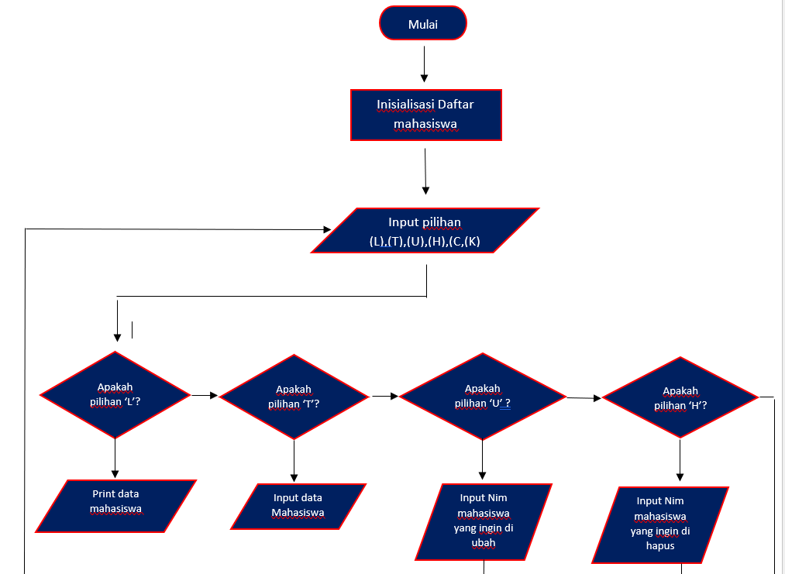
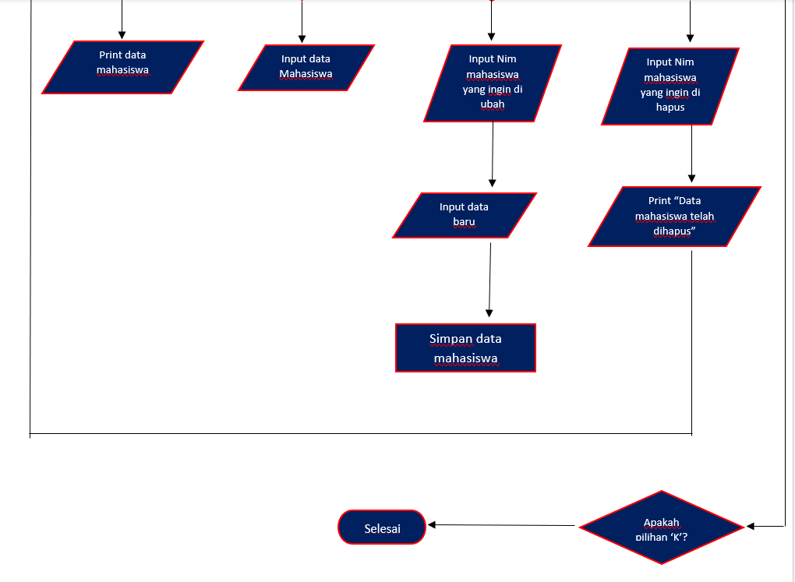
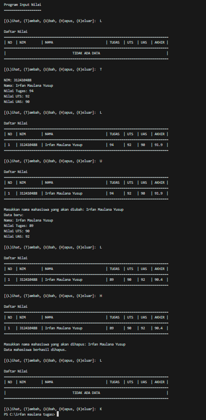

# labpy08
Nama : Irfan Maulana Yusup <p>
NIM : 312410488 <p>
Kelas : TI.24.A.5 <p>
Mata kuliah : Bahasa Pemrograman <p>
# ```Program Input Nilai```
## Diagram class

## Flowchart



## Code Program


### Penjelasan Program
1. Header dan Kelas Student:
   
```python
       print("\nProgram Input Nilai")
       print("===================")
      
       class Student:
           def __init__(self, nim, nama, tugas, uts, uas):
               self.nim = nim
               self.nama = nama
               self.tugas = tugas
               self.uts = uts
               self.uas = uas
               self.akhir = self.calculate_final_grade()
      
           def calculate_final_grade(self):
               return round((self.tugas * 0.3) + (self.uts * 0.35) + (self.uas * 0.35), 2)
   ```
   - Kode ini mencetak judul program dan mendefinisikan kelas ```Student``` yang memiliki atribut ```nim```, ```nama```, ```tugas```, ```uts```, ```uas```, dan ```akhir```.
   - ```calculate_final_grade``` adalah metode yang menghitung nilai akhir berdasarkan bobot tugas (30%), UTS (35%), dan UAS (35%).
       
2. Fungsi Menampilkan Menu dan Daftar Mahasiswa:

```python
       def display_menu():
                     print("\n[(L)ihat, (T)ambah, (U)bah, (H)apus, (K)eluar]: ", end=' ')
              
                 def display_students(students):
                     print("\nDaftar Nilai")
                     print("=" * 84)
                     print(f"| {'NO':<3} | {'NIM':<10} | {'NAMA':<30} | {'TUGAS':<6} | {'UTS':<4} | {'UAS':<4} | {'AKHIR':<5} |")
                     print("=" * 84)
                     if not students:
                        print(f"| {'TIDAK ADA DATA':^80} |")
                     else:
                         for i, student in enumerate(students, start=1):
                             print(f"| {i:<3} | {student.nim:<10} | {student.nama:<30} | {student.tugas:<6} | {student.uts:<4} | {student.uas:<4} | {student.akhir:<5} |")
                     print("=" * 84)
  ```        
   - ```display_menu``` menampilkan menu pilihan kepada pengguna.
   - ```display_students``` menampilkan daftar nilai mahasiswa dalam format tabel. Jika tidak ada data, pesan "TIDAK ADA DATA" akan ditampilkan.

3. Fungsi Mencari Indeks Mahasiswa:

```python
          def find_student_index(students, nim):
              for index, student in enumerate(students):
                  if student.nim == nim:
                     return index
              return None
```
   - ```find_student_index``` mencari indeks mahasiswa berdasarkan Nama. Mengembalikan ```None``` jika Nama tidak ditemukan.


4. Fungsi Utama:

```python
       def main():
           students = []
           while True:
               display_menu()
               choice = input().lower()
               if choice == 't':
                   nim = input("\nNIM: ")
                   nama = input("Nama: ")
                   tugas = int(input("Nilai Tugas: "))
                   uts = int(input("Nilai UTS: "))
                   uas = int(input("Nilai UAS: "))
                   students.append(Student(nim, nama, tugas, uts, uas))
               elif choice == 'l':
                   display_students(students)
               elif choice == 'u':
                   display_students(students)
                   nama = input("\nMasukkan nama mahasiswa yang akan diubah: ")
                   index = find_student_index(students, nama)
                   if index is not None:
                       print("Data baru:")
                       nama = input("Nama: ")
                       tugas = int(input("Nilai Tugas: "))
                       uts = int(input("Nilai UTS: "))
                       uas = int(input("Nilai UAS: "))
                       students[index] = Student(nim, nama, tugas, uts, uas)
                   else:
                       print("Mahasiswa dengan NIM tersebut tidak ditemukan.")
               elif choice == 'h':
                   display_students(students)
                   nama = input("\nMasukkan nama mahasiswa yang akan dihapus: ")
                   index = find_student_index(students, nama)
                   if index is not None:
                       del students[index]
                       print("Data mahasiswa berhasil dihapus.")
                   else:
                       print("Mahasiswa dengan NIM tersebut tidak ditemukan.")
               elif choice == 'k':
                   break
               else:
                   print("Pilihan tidak valid!")
       
       if __name__ == "__main__":
           main()
```
   -Fungsi utama main: Ini adalah fungsi kunci yang mengoperasikan keseluruhan program.
   
-Variabel students: Digunakan untuk menyimpan kumpulan objek Student.

-Program ini: Menampilkan menu dan mengelola opsi yang dipilih oleh pengguna:

-Tambah (t): Menambahkan data mahasiswa baru ke dalam daftar students.

-Lihat (l): Menampilkan seluruh daftar mahasiswa.

-Ubah (u): Memodifikasi data mahasiswa berdasarkan nama yang diberikan. Jika nama tersebut ditemukan, data mahasiswa diperbarui dengan informasi baru.

-Hapus (h): Menghapus data mahasiswa berdasarkan nama yang diberikan. Jika nama tersebut ditemukan, data mahasiswa akan dihapus dari daftar students.

-Keluar (k): Mengakhiri program.
## Output Program

